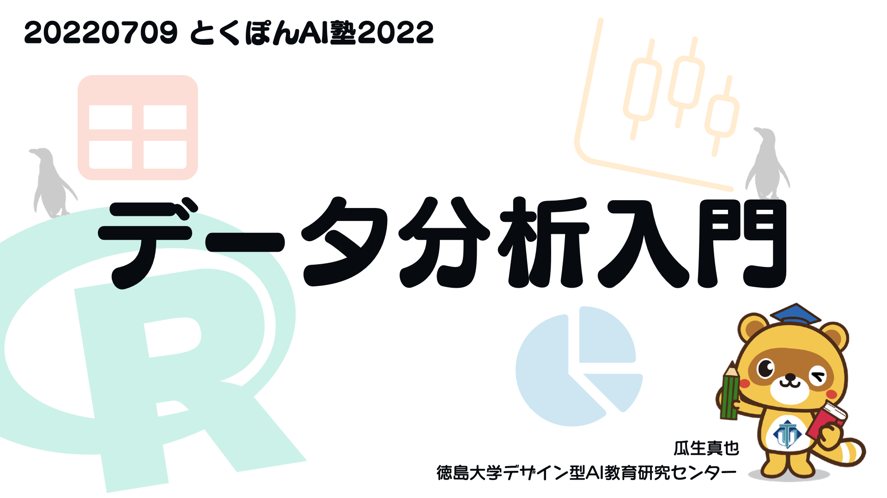

データ分析入門
==============

このリポジトリは徳島大学デザイン型AI教育研究センターが実施する
とくぽんAI塾のコース「データ分析入門」のための資料置き場です。

binderによる演習環境を提供しています。
上記のボタンをクリックすることでbinder上のRStduio Serverが起動します。
（起動に時間がかかることがあります）
これによりブラウザ上でRを動かすことができます。
必要なデータ、パッケージはすでにインストールされている状態です。
資料のqmdファイルを開き、内容を試してみてください。

## スライド

当日投影したスライドの公開版をSpeaker Deckで公開しています。

## ライセンス

MIT

[とくぽん](https://www.tokushima-u.ac.jp/about/profile/univ_mascot/)(徳島大学マスコットキャラクター)の著作権は徳島大学に帰属します。
